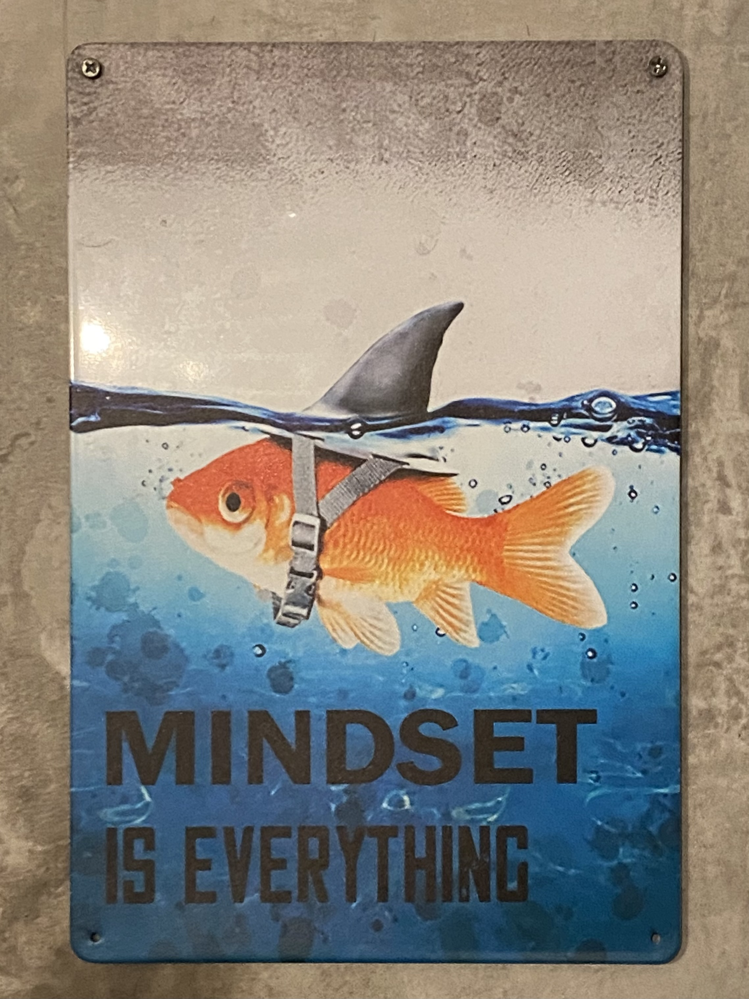

<!DOCTYPE html>
<html>
    
<head>
    <title> Jonas Holdaway | Test blog </title>
</head>
    
<body style="font-family: 'Times New Roman', Times, serif;">

<h1 style="font-family: 'Courier New', Courier, monospace;">Test blog</h1>

<i>8 Sept 2026</i>

It's nearly midnight, the night before I fly to Berlin to start a new life. I'm anxious to start work and figure out all the unknowns. For example: where is my apartment? If I paid for a month's rent, why will they not tell me my address? 
    
At the moment though, I'm learning HTML so I can develop what I hope will become a quaint 90s-style website where I can host my Berlin blog and rebuild the portfolio that I recently lost (alongside the whole Adobe suite). Tonight, I was watching YouTube and, although I generally avoid self-help material these days, I clicked on a video from a 20-something who told me to "stop watching other people do what you want to do, and do it yourself" (she was more eloquent). So here we are.

Let's try adding an image.

Nice. You, the reader, won't see it, but I just discovered that I don't need to make a new "branch" in GitHub for every page, which duplicates the entire site. Instead, I learned about folders (ooooo). I am proud and embarassed that I've never previously used GitHub, the coding platform that is generously hosting my website, so that will be part of this web dev exploration. 

</body>
</html>
